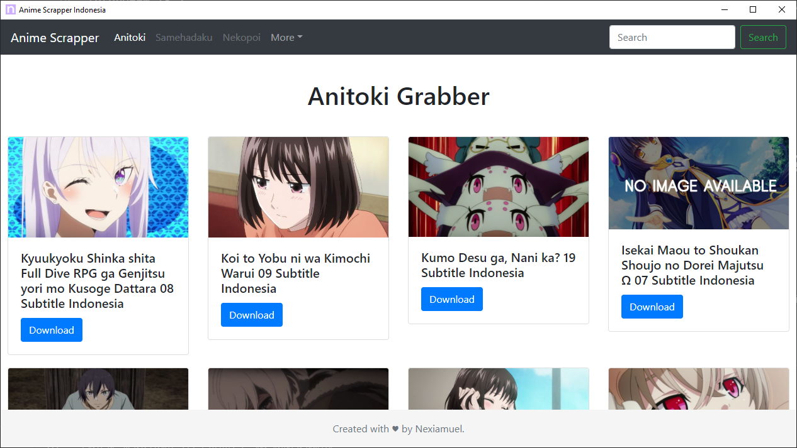
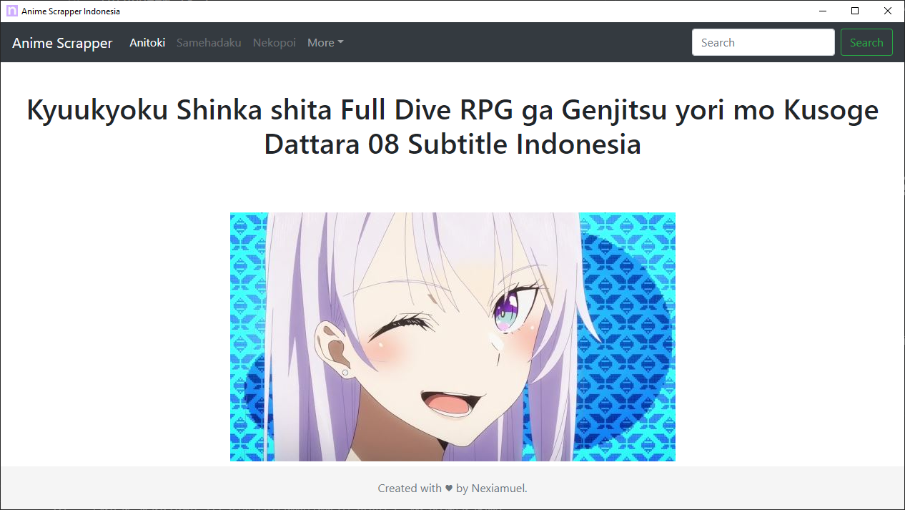

# Anime-grabber
Get anime list from anime fanshare, fansub website without browsing.





# What the plus side ?
+ Get download Get anime list
+ Fast

# What the minus side ?
- No Link Cache 

# How to use ?
- Clone this git
- Create Virtual Enviroment or without Virtual Enviroment
- Run command:
```bash
pip install -r requirement.txt
```
- Goto directory that you have clonned
- Run command:
```bash
python -m gui
```

- Select any anime, and you get the download link

# Task list
- [x] Push to my github for first time
- [x] Add anime description
- [x] Use GUI instead Terminal with image
- [ ] Pagination
- [x] Dynamic page

# Anime list
- [x] Anitoki
- [x] Samehadaku
- [ ] Nekopoi
- [ ] More will be added or open issues

## Contributing
Pull requests are welcome. For major changes, please open an issue first to discuss what you would like to change.

Please make sure to update tests as appropriate.

## License
[MIT](https://choosealicense.com/licenses/mit/)

#### Thanks to
- [**Neuron**](https://github.com/Andrew-Shay/Neuron) for providing template
